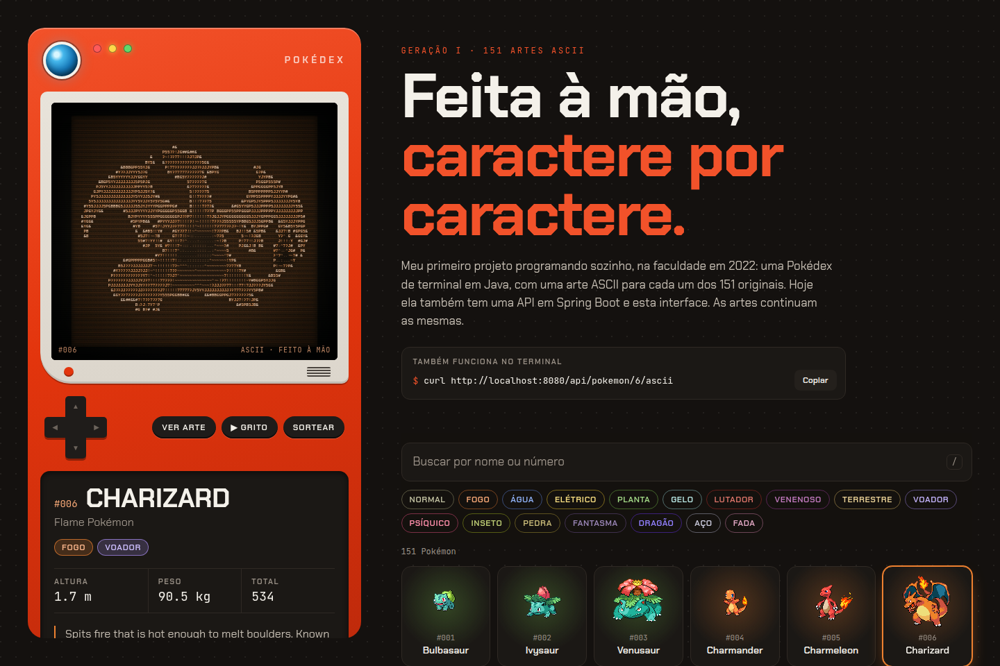
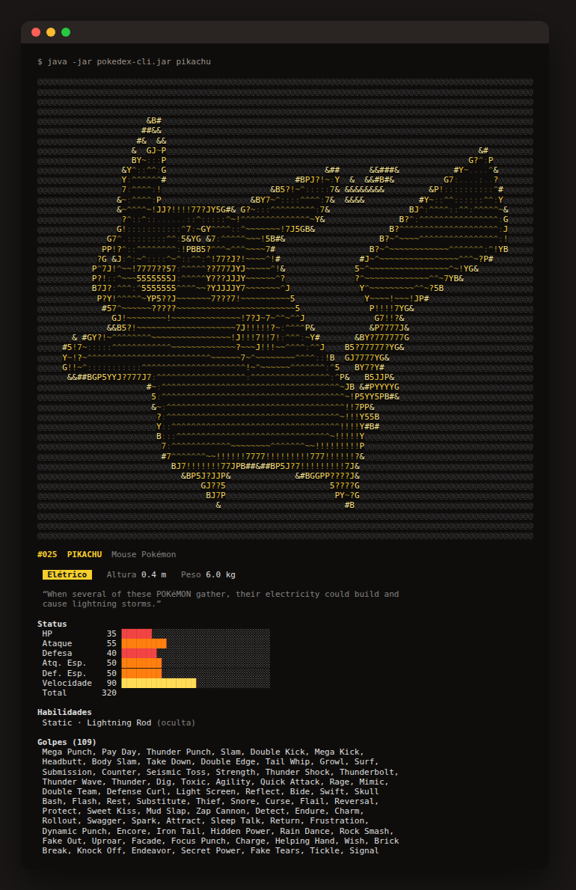
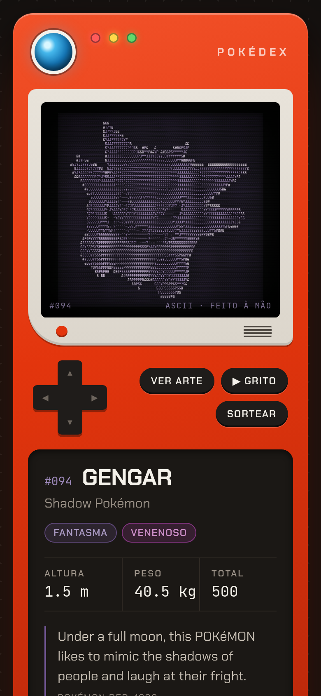
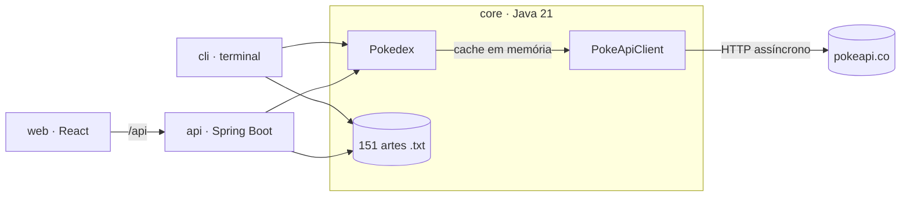

# Pokédex ASCII

[](https://github.com/Santiann/Pokedex--API/actions/workflows/ci.yml)


Os 151 Pokémon da primeira geração, cada um com uma **arte ASCII feita à mão**, no terminal e no navegador.



## A história

Este foi meu primeiro projeto programando sozinho, na faculdade, em 2022: uma Pokédex de terminal em Java que consumia a [PokeAPI](https://pokeapi.co) e mostrava uma arte ASCII para cada um dos 151 originais. As 151 artes ficavam num único `switch` de 7.300 linhas.

A versão 2.0 reconstrói o projeto com as ferramentas de hoje e mantém o que ele tinha de mais especial: **as artes são exatamente as mesmas, caractere por caractere**. O código original continua em [`legacy/`](legacy/) como registro de onde tudo começou.

| | 2022 | 2026 |
|---|---|---|
| Interface | Terminal | Terminal colorido + web + API REST |
| Build | Eclipse, com jars em `C:/Users/...` | Maven multi-módulo, roda em qualquer máquina |
| HTTP | `HttpURLConnection` + commons-io | `java.net.http.HttpClient` assíncrono, com retry |
| Artes ASCII | `switch` de 7.300 linhas | 151 arquivos de recurso, servidos por API |
| Testes | Nenhum | 57 testes (JUnit 5, MockMvc, Vitest) |
| Entrega | — | Docker + CI no GitHub Actions |

## O que tem

**Terminal** ([`cli/`](cli/)): a Pokédex original, repaginada. As artes ganham a cor do tipo do Pokémon, sombreada pela densidade de cada caractere. Também mostra barras de status e aceita busca por número ou nome (`25`, `#025`, `pikachu`, `Mr. Mime`, `Nidoran♀`).



**Web** ([`web/`](web/)): uma Pokédex com cara de aparelho, em que a arte ASCII é revelada numa tela de CRT. Tem alternância com a arte oficial, o grito de cada Pokémon, busca tolerante, filtro por tipo, atalhos de teclado (`/` busca, `←` `→` navegam) e link próprio para cada Pokémon.



**API** ([`api/`](api/)): Spring Boot 4 com documentação OpenAPI, erros no padrão [RFC 9457](https://www.rfc-editor.org/rfc/rfc9457) e cache HTTP. Ela também serve o frontend.

```bash
curl localhost:8080/api/pokemon/25/ascii   # a arte, direto no terminal
```

| Método | Rota | Descrição |
|---|---|---|
| `GET` | `/api/pokemon` | Os 151, com tipos e imagens |
| `GET` | `/api/pokemon/{número ou nome}` | Ficha completa: status, habilidades, golpes, descrição de Pokémon Red, grito |
| `GET` | `/api/pokemon/{número}/ascii` | Arte ASCII original, em `text/plain` |
| `GET` | `/docs` | Swagger UI |
| `GET` | `/actuator/health` | Health check |

## Arquitetura



- **`core`**: domínio com `record`s imutáveis, cliente da PokeAPI e as artes. Não depende de framework, por isso o CLI e a API usam o mesmo código.
- **Cache**: a PokeAPI [pede](https://pokeapi.co/docs/v2#fairuse) que os clientes guardem cache, e os dados da geração I não mudam. Na subida, a API carrega os 151 em paralelo com **virtual threads**, limitada a 10 requisições simultâneas, e depois tudo sai da memória.
- **Resiliência**: timeouts e até 3 tentativas para falhas de rede ou 5xx. Se a PokeAPI cair, a API responde `502` com uma mensagem clara.

## Rodando

Pré-requisitos: **Java 21** e **Node 22**. O Maven não precisa estar instalado, porque o projeto usa o wrapper (`./mvnw`).

```bash
# Terminal
./mvnw -pl core,cli package -DskipTests
java -jar cli/target/pokedex-cli.jar            # modo interativo
java -jar cli/target/pokedex-cli.jar pikachu 6  # mostra as fichas e sai

# API + web em desenvolvimento (dois terminais)
./mvnw install -DskipTests && ./mvnw -pl api spring-boot:run   # http://localhost:8080
cd web && npm install && npm run dev            # http://localhost:5173

# Tudo num jar só
(cd web && npm ci && npm run build) && ./mvnw package
java -jar api/target/pokedex-api.jar

# Docker
docker compose up -d --build                    # http://localhost:8080
```

O CLI segue as convenções [`NO_COLOR`](https://no-color.org) e `FORCE_COLOR`.

## Testes

```bash
./mvnw verify                 # core, CLI e API
cd web && npm test            # frontend
```

Os testes do backend não usam a internet: um servidor HTTP falso serve respostas reais da PokeAPI salvas como fixtures. Eles cobrem mapeamento, cache, busca por nome, números fora da geração I, retry e erros. Há também um teste que garante que as 151 artes continuam presentes.

## Deploy

O [`render.yaml`](render.yaml) publica a imagem Docker no plano gratuito do [Render](https://render.com): basta conectar o repositório em *New → Blueprint*. Qualquer serviço que rode Docker funciona, e a porta vem da variável `PORT`.

## Stack

Java 21 · Spring Boot 4 · Jackson 3 · springdoc-openapi · JUnit 5 · AssertJ · React 19 · TypeScript · Vite · Tailwind CSS 4 · TanStack Query · Vitest · Testing Library · Docker · GitHub Actions

---

Dados da [PokeAPI](https://pokeapi.co). Pokémon é marca registrada da Nintendo, Game Freak e Creatures. Projeto de estudo, sem fins comerciais.
